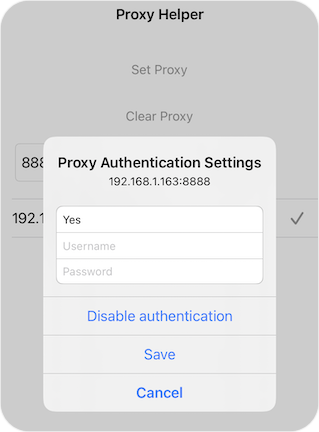

# pxySwitch

[中文介绍](./readme_cn.md)

Supports both rootless and rootful jailbreak, providing convenient proxy settings

Setting up WiFi proxy on iPhone or iPad is a tedious process, typically requiring the following steps:
1. Open Settings, select Wi-Fi
2. Enter the Wi-Fi list, tap the info icon next to the connected WiFi
3. In the details page, scroll to the bottom, select HTTP Proxy
4. Enter the HTTP Proxy settings page, select Manual
5. Fill in the server address, port number, authentication username and password
6. Tap "Save" in the upper right corner

pxySwitch makes it easy to set up proxies. After opening, enter the port number you want to search, then click Search. It will list all connectable IPs. Select one and click Set Proxy to configure the proxy!





## Usage
1. Enter the port number you want to search and click "Search"
2. Select the found IP that can be connected
3. If authentication is required, long press to enable authentication
4. Click "Set Proxy" to set up the proxy. After testing, sometimes it may need to be clicked twice to take effect
5. Click "Clear Proxy" to cancel the proxy

## Compilation
Project compilation requires private library, WiFiKit, located in the `$THEOS/sdks` directory
Need to modify Makefile to `iphone:$THSOS/sdks/iPhoneOS_Ver:TARGET_OS_VER`, such as
iphone:16.5:13.0

```
make
make package FINALPACKAGE=1
```

To compile the rootless version:
```
make package THEOS_PACKAGE_SCHEME=rootless FINALPACKAGE=1
```

## References
[appstraction](https://github.com/tweaselORG/appstraction/issues/25#issuecomment-1447926111)