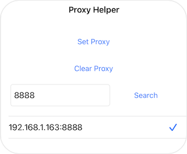
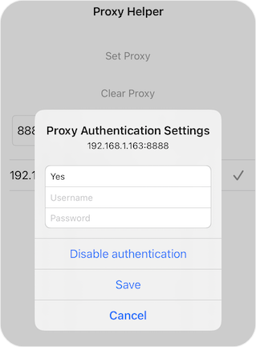

# pxySwitch

支持无根和有根越狱，提供便捷的代理设置

在iPhone或iPad上设置WiFi代理是一个繁琐的过程，通常需要以下步骤：
1. 打开设置，选择Wi-Fi
2. 进入Wi-Fi列表，点击已连接WiFi旁边的信息图标
3. 在详情页面，滚动到底部，选择HTTP代理
4. 进入HTTP代理设置页面，选择手动
5. 填写服务器地址、端口号、认证用户名和密码
6. 点击右上角的“保存”

pxySwitch使代理设置变得简单。打开后，输入要搜索的端口号，然后点击搜索。它会列出所有可连接的IP。选择一个并点击设置代理来配置代理！




## 使用说明
1. 输入要搜索的端口号并点击“搜索”
2. 选择找到的可连接IP
3. 如果需要认证，长按以启用认证
4. 点击“设置代理”来设置代理。测试后，有时可能需要点击两次才能生效
5. 点击“清除代理”以取消代理

## 编译
项目编译需要私有库WiFiKit，位于`$THEOS/sdks`目录下
需要修改Makefile为`iphone:$THSOS/sdks/iPhoneOS_Ver:TARGET_OS_VER`，例如
iphone:16.5:13.0

```
make
make package FINALPACKAGE=1
```

编译无根版本：
```
make package THEOS_PACKAGE_SCHEME=rootless FINALPACKAGE=1
```

## 参考
[appstraction](https://github.com/tweaselORG/appstraction/issues/25#issuecomment-1447926111)